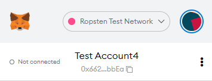

# Krypt Token app. 

App is live on: https://krypttoken.com/

Connected with smart contract deployed on Ropsten Test Network. 
You can find smart contract code in this repo: https://github.com/BlackH3art/crypto-app-smart-contract

It's a tutorial based application which in I implemented:
- ERC20 custom KYT Token 
- Public Sale of this KYT token

Ico contract is deployed on address:
https://ropsten.etherscan.io/address/0x7DDF4182d7a9aa39723d0d0423f1D067e3291725

-----

If you wanna try this app:
1. Install metamask as an extension to your browser: https://metamask.io/
2. You need to create account and be connected to the Ropsten Test Network:

3. You need to have some ETH on your account, you can request some test Ethereum tokens here: https://faucet.ropsten.be/
4. Wait a bit until you get your ETH as the transaction need to be processed, and you good to go.

----

Application is based on JavaScript Mastery tutorial. So please visit his channel, leave a like, subscribe if your'e not already, he's doing the great job teaching people <3 : https://www.youtube.com/watch?v=Wn_Kb3MR_cU

Also visit his github repo and leave a star:
https://github.com/adrianhajdin/project_web3.0

----

